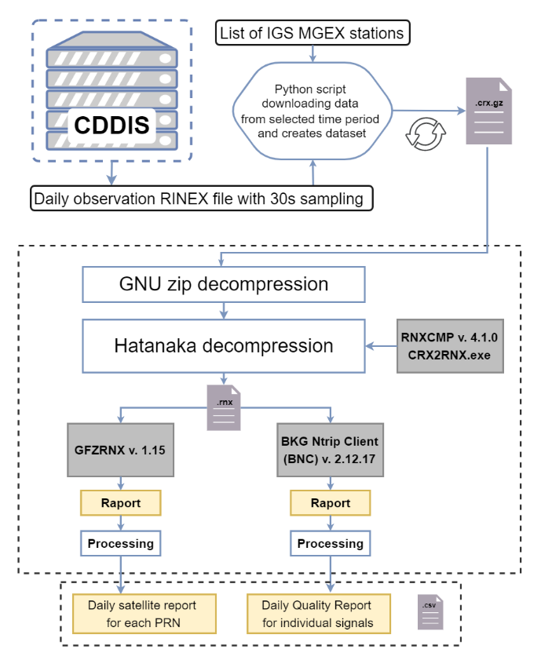

# RINEX-status-file
<h2>Generate a status file based on RINEX v3 from IGS MGEX stations</h2> 
<li>main file to run script: main.py </li>
<li>dataset uses in software: data_to_script (MGEX list, satellite list) </li>
<li>folder to generated status files: download_data</li>
<h3>Processing diagram</h3> 
 
<h4>Script export text files with:(csv) files:</h4>
<li>daily satellite report for each PRN per day</li>
<li>daily quality report for individual signal per day</li>
